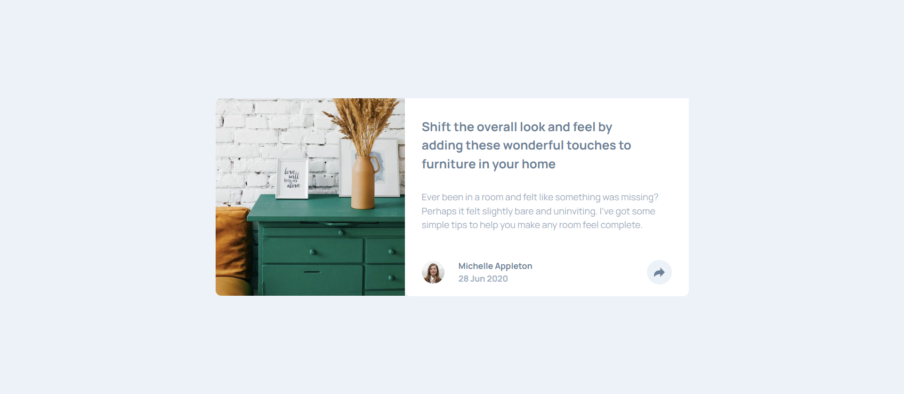
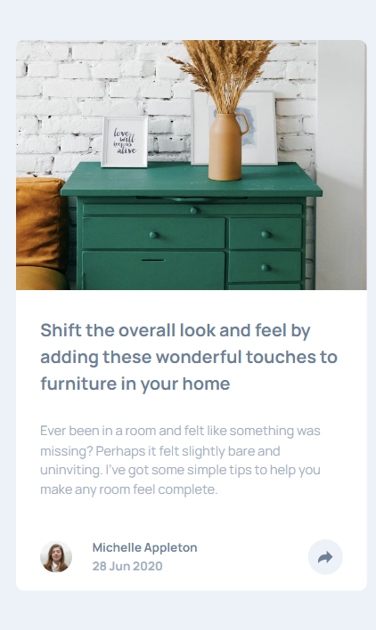

## Overview
This a simple article preview component made with HTML, CSS and JavaScript. Users can view the optimal layout for the component depending on their device's screen. Also, social meadia share links can be seen when the share icon is clicked.

### Screenshot

### Links

- [Codes](https://github.com/sanyomor-01/article-preview)
- [Live site](https://article-preview-lime.vercel.app/)

### Built with

- Semantic HTML5 markup
- CSS custom properties
- Flexbox
- CSS Grid
- Mobile-first workflow

## Author

- Frontend Mentor - [Mike](https://www.frontendmentor.io/profile/sanyomor-01)
- Twitter - [@sanyo_mor](https://www.twitter.com/sanyo_mor)

